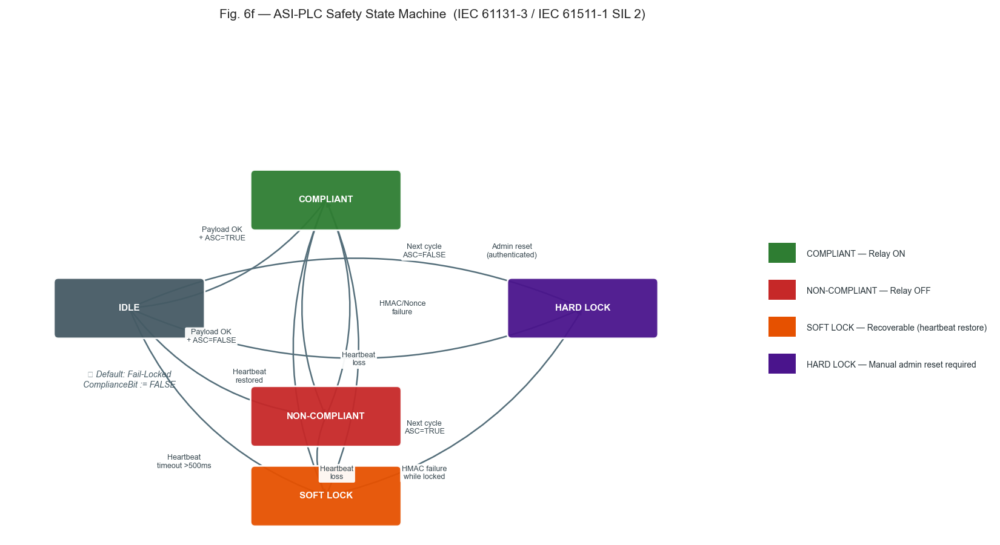
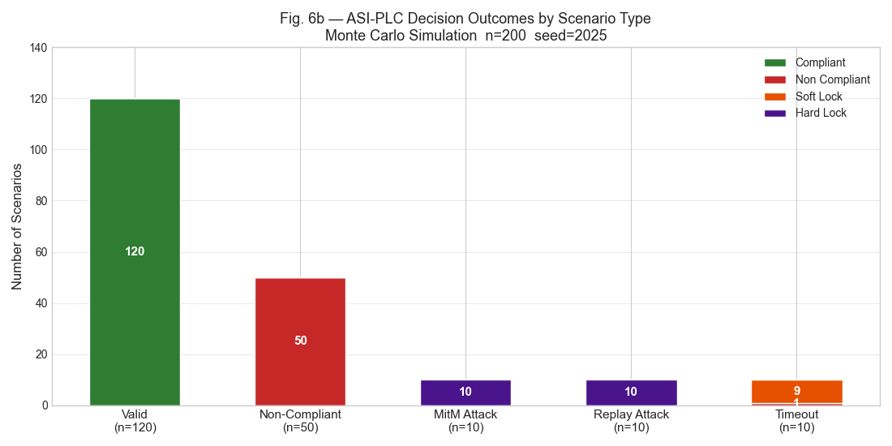
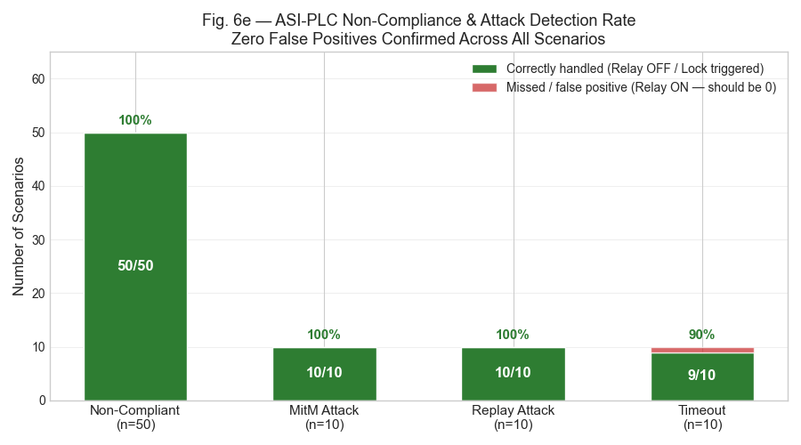
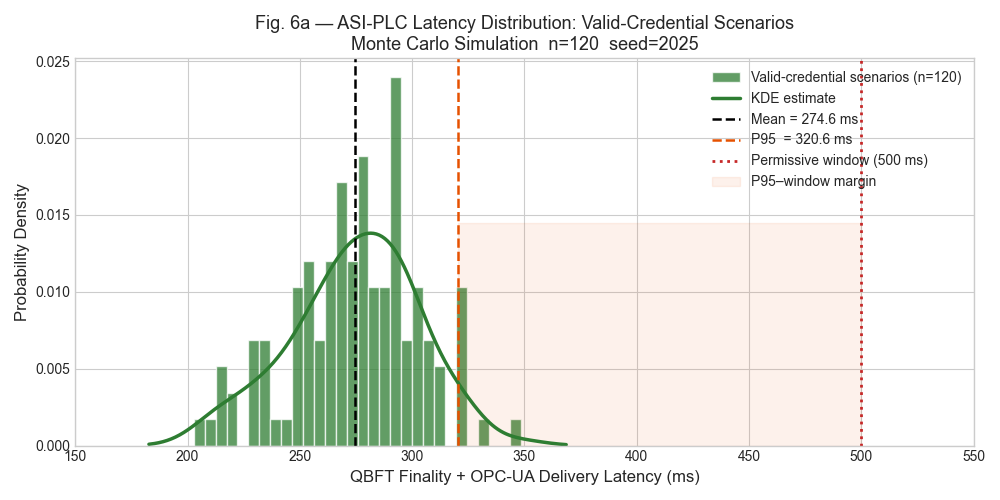
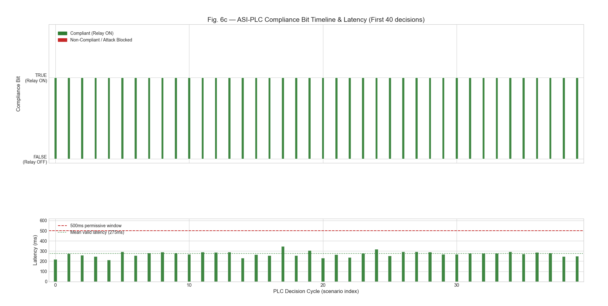
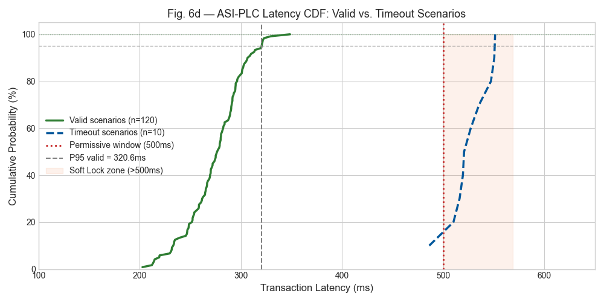

# Adaptive Trust Chain (ATC) — Phase 4: ASI-PLC Simulator

> **Companion code for:**
> Sk. Riad Bin Ashraf, Bernd Noche, Tan Gürpinar — *"Adaptive Trust Chain (ATC): A Blockchain-Based Weld Certification Framework for Structural Integrity Assurance in Green Hydrogen Infrastructure"* — IEEE Access (under review)
> Chair of Transport Systems and Logistics (TuL), University of Duisburg-Essen, Germany

---

## Overview

This repository contains the Phase 4 prototype simulation for the **Autonomous Safety Interlock (ASI-PLC)** — the hardware-enforcement layer of the Adaptive Trust Chain framework. The ATC is a five-layer permissioned blockchain architecture that closes the *passive safety gap* in weld certification for green hydrogen infrastructure by translating blockchain compliance state into a physical **Compliance Bit** at Safety PLC level via OPC-UA.

The Phase 4 simulator reproduces the five-step Compliance Bit decision cycle (Algorithm 2 in the paper) and all Monte Carlo results reported in **Section VII-E** of the manuscript. It is a design-level prototype — latency parameters are derived from published Hyperledger Besu QBFT benchmarks, not a deployed physical system.

---

## Background

Welded joints in green hydrogen infrastructure operate under pressures exceeding 700 bar and are susceptible to **hydrogen embrittlement (HE)** in the weld heat-affected zone (HAZ). Prevailing certification practice relies on paper-based procedure logs and post-fabrication audits — a *passive safety gap* that gives rise to:

- **Administrative latency**: credential expiry not matched by equipment lockout
- **Traceability deficits**: in-process parameters cannot be reconstructed after a structural failure

The ATC addresses this by linking a Hyperledger Besu QBFT blockchain directly to a SIL 2-rated Safety PLC. The **Compliance Bit** is `FALSE` by default (Fail-Locked design). The welding relay energises **if and only if** all upstream checks pass and the Oracle payload is cryptographically verified.

---

## Repository Structure

```
atc-phase4/
│
├── Prototype.py              # Core simulation — reproduces paper figures & Table 8
├── Prototype_app.py          # Interactive Streamlit UI for exploratory analysis
├── asi_plc_simulator.html    # Browser-based interactive ASI-PLC state machine demo
├── run_atc_app.bat           # One-click launcher for the Streamlit app (Windows)
├── Images/                   # Simulation output figures (Figs. 6a–6f)
│   ├── Figure_1.png      # Fig. 6a — ASI-PLC Latency Distribution
│   ├── Figure_2.png      # Fig. 6b — Decision Outcomes by Scenario Type
│   ├── Figure_3.png      # Fig. 6c — Compliance Bit Timeline & Latency
│   ├── Figure_4.png      # Fig. 6d — Latency CDF: Valid vs. Timeout
│   ├── Figure_5.png      # Fig. 6e — Non-Compliance & Attack Detection Rate
│   └── Figure_6.png      # Fig. 6f — ASI-PLC Safety State Machine
└── README.md
```

**Build phases referenced in the paper (Phases 1–3 available from the corresponding author):**

| Phase | Artefact                                | Description                                         |
| ----- | --------------------------------------- | --------------------------------------------------- |
| 1     | `WeldComplianceASC.sol`                 | Solidity 0.8.20 Adaptive Smart Contract             |
| 2     | Quantitative simulations                | Weibull, Paris–Erdogan, DTMC models                 |
| 3     | Oracle Gateway Simulator                | Payload generation and signing                      |
| **4** | **`Prototype.py` / `Prototype_app.py`** | **ASI-PLC state machine & Monte Carlo (this repo)** |

---

## The ASI-PLC State Machine

The simulator implements the five-step Compliance Bit decision cycle from **Algorithm 2** in the paper, running on a 500 ms cycle aligned with the QBFT finality window:

```
Step 1 — Heartbeat Monitoring   → Latency > 500 ms          ⟹ SOFT_LOCK
Step 2 — Anti-Replay Check      → Nonce ≤ last nonce         ⟹ HARD_LOCK
Step 3 — HMAC-SHA256 Verify     → Signature mismatch         ⟹ HARD_LOCK (MitM detected)
Step 4 — Asymmetric Sig Verify  → Oracle identity unverified ⟹ HARD_LOCK
Step 5 — Compliance Bit         → All checks passed          ⟹ COMPLIANT / NON_COMPLIANT
```

**PLC States:**

| State           | Meaning                                         | Recovery                           |
| --------------- | ----------------------------------------------- | ---------------------------------- |
| `IDLE`          | Awaiting first Oracle payload                   | —                                  |
| `COMPLIANT`     | Compliance Bit TRUE — relay energised           | —                                  |
| `NON_COMPLIANT` | ASC returned FALSE (e.g. preheat below minimum) | Automatic on next valid cycle      |
| `SOFT_LOCK`     | Heartbeat timeout (>500 ms)                     | Automatic on restored connectivity |
| `HARD_LOCK`     | Cryptographic failure (MitM / replay)           | **Manual admin reset required**    |

The full state transition diagram (IEC 61131-3 / IEC 61511-1 SIL 2) is shown below:

[](Images/Figure_6.png)

*Fig. 6f — ASI-PLC Safety State Machine (IEC 61131-3 / IEC 61511-1 SIL 2). Default state is Fail-Locked (ComplianceBit := FALSE). HARD LOCK requires authenticated manual admin reset; SOFT LOCK recovers automatically on heartbeat restoration.*

---

## Monte Carlo Simulation (n = 200, seed = 2025)

`Prototype.py` runs 200 welding operation scenarios across five fault types and reproduces all results in **Section VII-E** and **Table 8** of the paper.

**Default scenario plan:**

| Scenario           | Count | Fault Type   | Expected Outcome           |
| ------------------ | ----- | ------------ | -------------------------- |
| Valid (compliant)  | 120   | `NONE`       | `COMPLIANT`, relay ON      |
| Non-compliant weld | 50    | `NON_COMPLY` | `NON_COMPLIANT`, relay OFF |
| MitM attack        | 10    | `MITM`       | `HARD_LOCK`, relay OFF     |
| Replay attack      | 10    | `REPLAY`     | `HARD_LOCK`, relay OFF     |
| Oracle timeout     | 10    | `TIMEOUT`    | `SOFT_LOCK`, relay OFF     |

### Decision Outcomes by Scenario Type

[](Images/Figure_2.png)

*Fig. 6b — ASI-PLC decision outcomes across all 200 scenarios (n=200, seed=2025). All 120 valid scenarios resolve as COMPLIANT; all MitM and Replay attacks trigger HARD_LOCK; 9/10 timeout scenarios trigger SOFT_LOCK.*

### Non-Compliance and Attack Detection Rate

[](Images/Figure_5.png)

*Fig. 6e — Zero false positives confirmed across all 80 non-compliant and attack scenarios. Non-compliant: 50/50 (100%); MitM: 10/10 (100%); Replay: 10/10 (100%); Timeout: 9/10 (90%, one scenario at boundary latency).*

**Key results (reproduced from paper):**

- Valid scenario mean latency: **275.2 ms** (P95 = 371.4 ms) — within the 500 ms permissive window
- **Zero false positives** across all 80 non-compliant/attack scenarios
- Timeout scenarios trigger Soft Lock at mean **514.6 ms** (SD ≈ 20 ms)

> ⚠️ These results confirm the logical correctness of the simulation model under the assumed latency distributions. They are not measurements from a deployed physical system.

---

## Simulation Output Figures

Running `Prototype.py` generates the following six publication-quality figures, saved to the `Images/` folder.

### Fig. 6a — ASI-PLC Latency Distribution: Valid-Credential Scenarios

[](Images/Figure_1.png)

*QBFT finality + OPC-UA delivery latency for valid-credential scenarios (n=120, seed=2025). Mean = 275.2 ms; P95 = 371.4 ms. All valid scenarios fall well within the 500 ms permissive window. KDE overlay confirms near-normal distribution.*

---

### Fig. 6c — Compliance Bit Timeline & Latency (First 40 Decisions)

[](Images/Figure_3.png)

*Top panel: Compliance Bit state (TRUE/FALSE) over the first 40 PLC decision cycles. Bottom panel: per-cycle latency with 500 ms permissive window and mean valid latency (275 ms) reference lines. All 40 valid-credential cycles resolve as COMPLIANT with latency well below the threshold.*

---

### Fig. 6d — ASI-PLC Latency CDF: Valid vs. Timeout Scenarios

[](Images/Figure_4.png)

*Cumulative distribution functions for valid (n=120, solid green) and timeout (n=10, dashed blue) scenarios. Valid P95 = 371.4 ms; the entire valid CDF sits below the 500 ms permissive window. All timeout scenarios fall in the Soft Lock zone (>500 ms), confirming clean separation between the two populations.*

---

## Security Scenarios Tested

| Threat                       | Injection Method                                      | ATC Response                                   |
| ---------------------------- | ----------------------------------------------------- | ---------------------------------------------- |
| **MitM payload injection**   | HMAC signature corrupted                              | HARD\_LOCK — manual reset required             |
| **Replay attack**            | Stale nonce re-used (nonce = 1)                       | HARD\_LOCK — monotonic nonce check fails       |
| **Oracle connectivity loss** | Latency drawn from `N(514.6, 20)` ms                  | SOFT\_LOCK — relay de-energised, auto-recovers |
| **Non-compliant weld**       | `compliant_flag = False` (e.g. preheat below minimum) | `NON_COMPLIANT` — relay stays off              |

These correspond to the STRIDE threat model in **Table IV** of the paper.

---

## Installation

**Requirements:** Python 3.10+ (developed and tested on Python 3.14)

```
pip install numpy scipy matplotlib seaborn streamlit
```

For Windows users with Python 3.14 installed at `c:\python314\`, the batch launcher uses that path directly.

---

## Usage

### Command-line simulation (reproduces paper figures)

```
python Prototype.py
```

Outputs 6 publication-quality figures (Figs. 6a–6f) to the `Images/` folder.

### Interactive Streamlit app

```
streamlit run Prototype_app.py
```

Or on Windows, double-click `run_atc_app.bat`.

The app provides:

- Adjustable scenario counts and random seed via sidebar controls
- Live metric cards (total scenarios, false positives/negatives, hard lock events)
- Latency distribution histogram
- PLC state distribution bar chart
- Scrollable scenario detail table (first 30 results)
- Full state count JSON export

---

## Reproducibility

All simulation parameters are fully documented in **Tables 4–6** of the manuscript. To reproduce the exact paper results:

```python
# Fixed seed ensures identical latency draws and scenario outcomes
seed = 2025
```

The simulation uses `numpy.random.default_rng(seed)` throughout. No external data files are required.

---

## Limitations and Scope

This prototype is a **design-level plausibility check**, not an empirical validation of deployed hardware:

- Latency parameters are drawn from published QBFT benchmarks (Saleh & Cevik, 2025), not measured on a physical fabrication floor
- The HMAC/asymmetric signature verification is a faithful software simulation; production deployment requires a hardware security module (HSM) for the Oracle private key
- Field measurement of latency and false-positive rates under industrial electromagnetic and network conditions remains a prerequisite for operational deployment

---

## Citation

If you use this code in your research, please cite:

```bibtex
@article{ashraf2025atc,
  author  = {Sk. Riad Bin Ashraf, Hasibur Rahman, Bernd Noche, Gürpinar Tan},
  title   = {Adaptive Trust Chain (ATC): A Blockchain-Based Weld Certification
             Framework for Structural Integrity Assurance in Green Hydrogen
             Infrastructure},
  journal = {IEEE Access},
  year    = {2025},
  note    = {Under review}
}
```

---

## Authors

**Sk. Riad Bin Ashraf** · **Hasibur Rahman** · **Bernd Noche** · **Tan Gürpinar**  
Chair of Transport Systems and Logistics (TuL), Faculty of Engineering  
University of Duisburg-Essen, 47057 Duisburg, Germany  
Correspondence: shake.ashraf@uni-due.de

---

## License

This code is released for academic reproducibility. For commercial use or deployment in safety-critical systems, please contact the authors. No warranty is provided; this is a research prototype and must not be used as-is in any production or regulatory context.
